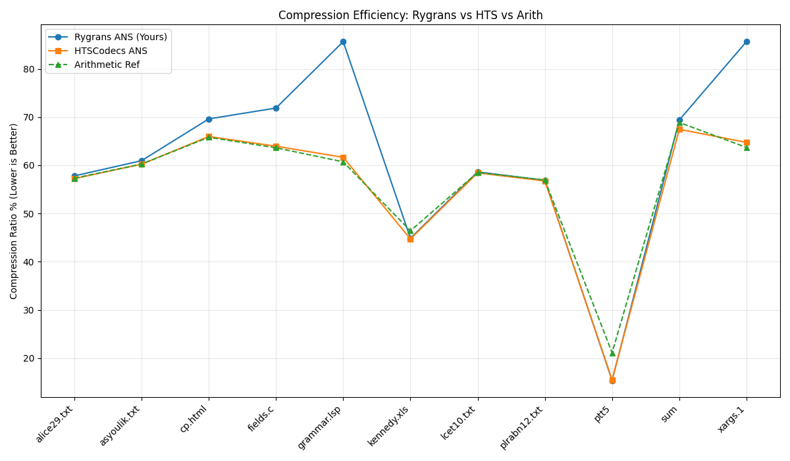

# Integrated rANS Compression & Cryptographic Entropy Analysis

## 🎓 Academic Context
This research project is being conducted as a **Senior Capstone Project (Final Project)** at the Department of Computer Science, **Ariel University**. 

## 📝 Project Overview
The project explores the intersection of **Entropy Coding** and **Cryptography**. The primary focus is investigating the feasibility and efficiency of compressing data streams that have undergone cryptographic transformations using **Range Asymmetric Numeral Systems (rANS)**.

### The Core Research Challenge
In information theory, ideal encryption maximizes entropy, making the data appear as stochastic noise. According to Shannon's source coding theorem, such data should be incompressible. This project evaluates whether specialized rANS implementations can detect and exploit residual redundancies or structural patterns in various encryption-compression pipelines.

## 🎯 Key Research Objectives
* **Entropy Analysis**: Quantifying the impact of different encryption layers on data compressibility.
* **Integrated Pipeline**: Developing a unified framework for simultaneous encryption and rANS-based compression.
* **Comparative Benchmarking**: Evaluating our custom C++ rANS engine against industry standards and reference models.

## 📊 Benchmarking & Results
We utilize the **Canterbury Corpus**, a standard reference for lossless data compression, to validate our results.

### Compression Efficiency Analysis
The graph below illustrates the **Compression Ratio (%)** across different file types (Lower is Better). Our implementation is compared against **HTSCodecs ANS** and a standard **Arithmetic Coding** reference.

*Our findings indicate that the rANS engine achieves competitive ratios on large datasets, with specific optimizations in high-entropy scenarios like the `ptt5` corpus.*

## 🛠 Technical Architecture
* **Engine**: High-performance C++ implementation of the rANS entropy coder.
* **Data Science Layer**: Python-based automated benchmarking suite utilizing **Pandas** for data manipulation and **Matplotlib** for analytical visualization.
* **Methodology**: Systematic comparison of static vs. adaptive modeling in encrypted environments.

## 🚀 Getting Started
1. **Prerequisites**: GCC (C++17 or higher) and Python 3.x.
2. **Build**: Utilize the provided `.bat` scripts in the `libs/` and `reference/` directories to compile the engines.
3. **Execution**: Run `python src/final_summary.py` to initiate the full benchmarking suite and generate the analytical reports.

## 📧 Contact
Developed by Computer Science Students, Ariel University.
